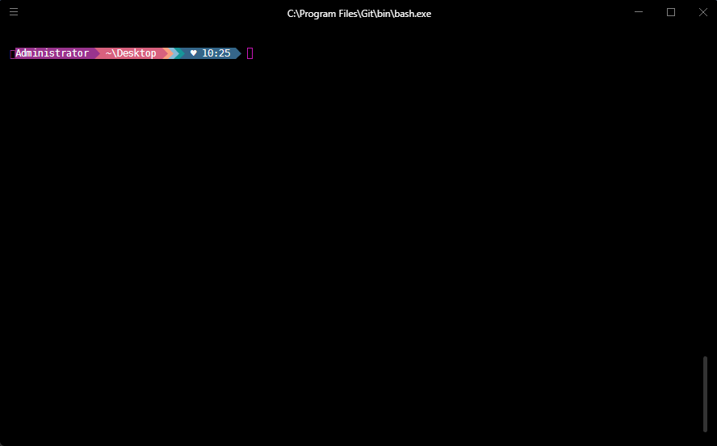
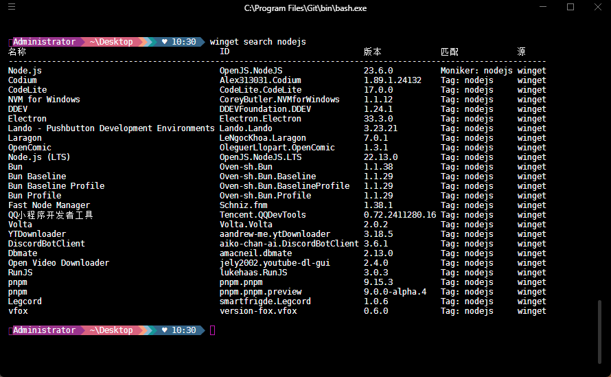
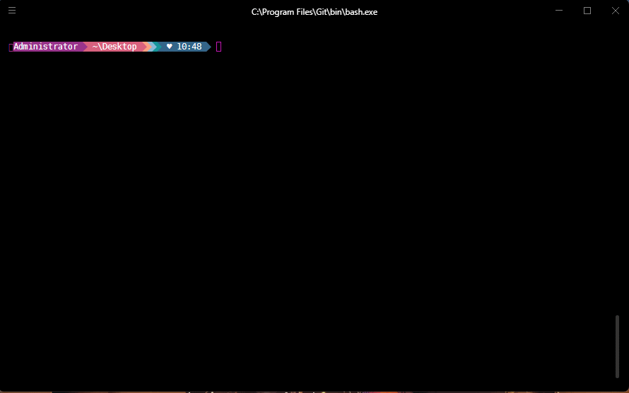
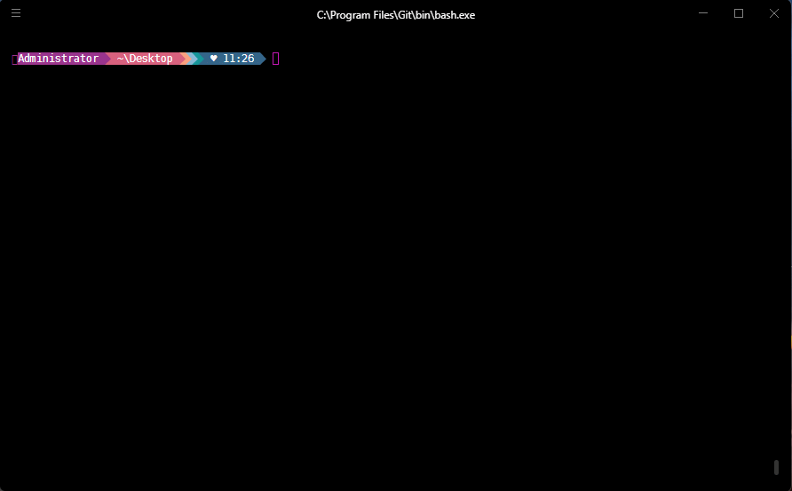

> [!IMPORTANT]
>
> * ① winget 软件包管理器所管理的很多软件包可能会托管在 GitHub 上，因此需要你科学上网，否则可能会因为网络问题而导致软件包安装失败。
> * ② Win10 之后的很多系统内置软件，就是通过 winget 软件包管理器来进行安装的。


# 第一章：简介

## 1.1 Linux 中的软件包管理器

* 如果你玩过 Linux，一定对 Linux 中的软件包管理器并不陌生，如：`apt` 和 `dnf` 等，其主要目标是用来`解决依赖管理，简化软件包的安装`。


## 1.2 Windows 中的软件包管理器

* Windows 操作系统本身就是以`图形用户界面（GUI）`为主，早期大多数人都是通过鼠标下一步来安装软件包，Windows 上的软件包的格式通常是 `.exe`、`.msi` 以及 `.zip`，一旦软件包更新之后（新版本的推出），还需要用户重新下载并进行安装，以便体验最新的功能。


* 但是，随着时间的发展，Windows 社区吸收了 Linux 社区的思想，将软件包管理器也带入了 Windows 中，这样在 Windows 中我们也可以通过命令行来安装软件包。

> [!NOTE]
>
> * ① 软件包管理器是 Windows 的附加工具，用户可以选择使用，也可以直接通过网页或商店安装软件包。
> * ② 在 Windows 11、 Windows 10 1709（版本 16299）或更高版本上以及 Windows Server 2025 中，Windows 开箱支持 WinGet 程序包管理器。

* Linux 中的软件包管理器有多种，如：`dnf` 和 `apt` 等，Windows 也不例外，如下所示：
  * ① `winget（Windows Package Manager）`：Windows 官方支持，非常稳定。
  * ② `Chocolatey`：社区支持，但是维护的大量的软件包。
  * ③ `Scoop`：社区支持，主打轻量化。
  * ④ `Ninite`：一次性安装并更新所有程序（如果你不熟悉命令行，可以选择该工具）。

* WIndows 软件包管理器的特别，如下所示：

| Windows软件包管理器 | 特点                                                         |
| ------------------- | ------------------------------------------------------------ |
| winget              | ① 官方提供，由微软开发。<br>② 命令行工具，可以快速安装、升级和卸载软件。<br>③ 包含常见的第三方软件包。 |
| Chocolatey          | ① 长期流行的第三方软件包管理器。<br>② 支持许多开发工具、服务和常见软件。<br/>③ 提供商业版支持。 |
| Scoop               | ① 专注于开发者工具，如编程语言、数据库等。<br>② 无需管理员权限即可安装。<br>③ 使用简洁，易于扩展。 |
| Ninite              | ① 简单易用，适合普通用户。<br>② 自动化安装和更新常见软件，如：浏览器、媒体播放器等。 |

## 1.3 软件包管理器原理

* 用户通过`命令行`执行一系列的`命令`操作，让软件包管理器去`远程仓库`下载指定的软件包并安装到本地计算机，如下所示：


# 第二章：winget

## 2.1 概述

* 开发人员可以使用 `winget` 命令行工具发现、安装、升级、删除和配置特选应用程序集。 
* 安装后，开发人员可以通过 Windows 终端、PowerShell 或命令提示符访问 `winget`。

## 2.2 启用 tab 自动补全（仅限于 PowerShell ）

### 2.2.1 PowerShell 修改安全策略

* ① 使用 `win + x` 快捷键，选择 `Windows PowerShell（管理员）`：


* ② 修改安全策略：

```powershell
Set-ExecutionPolicy -ExecutionPolicy RemoteSigned
```


* ③ 关闭终端，并重新打开：


### 2.2.2 启用 Tab 自动补全

* ① 打开 PowerShell ，并输入以下命令，在记事本中打开 `$PROFILE`：

```powershell
notepad.exe $PROFILE
```


* ② 将以下脚本复制并粘贴到已在记事本中打开的 `$PROFILE` 文件，保存并关闭 PowerShell ：

```powershell
Register-ArgumentCompleter -Native -CommandName winget -ScriptBlock {
    param($wordToComplete, $commandAst, $cursorPosition)
        [Console]::InputEncoding = [Console]::OutputEncoding = $OutputEncoding = [System.Text.Utf8Encoding]::new()
        $Local:word = $wordToComplete.Replace('"', '""')
        $Local:ast = $commandAst.ToString().Replace('"', '""')
        winget complete --word="$Local:word" --commandline "$Local:ast" --position $cursorPosition | ForEach-Object {
            [System.Management.Automation.CompletionResult]::new($_, $_, 'ParameterValue', $_)
        }
}
```


* ③ 重新打开 PowerShell ，就会发现 `winget tab` 可以自动补全：


## 2.3 基本操作（CRUD，⭐）

### 2.3.1 搜索软件

* 命令：

```shell
winget search [可选参数] [-q] <软件名> 
```

> [!NOTE]
>
> 参数：
>
> * `-q、--query`：查询标志是用于搜索应用的默认参数。 无需指定。
>
> 可选参数：
>
> * `--id`：将搜索限制为应用程序的 ID。 该 ID 包含发布者和应用程序名称。
> * `--name`：将搜索限制为应用程序的名称。
> * `-s（--source）`：使用指定的源名称（msstore 等）查找包。
> * `--versions`：显示程序包的可用版本。


* 示例：查询指定的软件包

```cmd
winget search nodejs
```




* 示例：根据 id 查询指定的软件包

```cmd
winget search --id OpenJS.NodeJS.LTS
```



* 示例：根据 name 查询指定的软件包

```cmd
winget search --name Node.js
```




* 示例：查询所有可用的软件包

::: code-group

```cmd
winget search -q ""
```

```powershell
winget search -q `"`"
```

:::


* 示例：跨源搜索（结果范围缩小到特定源）

```cmd
winget search "Visual Studio Code" -s msstore
```


* 示例：显示软件包的所有可用版本（软件包需要精确匹配）

```cmd
winget search --id Microsoft.PowerToys --versions
```



### 2.3.2 安装软件

* 命令：

```shell
winget install [可选参数] [-q] <软件名> 
```

> [!NOTE]
>
> 参数：
>
> * `-q、--query`：查询标志是用于搜索应用的默认参数。 无需指定。
>
> 可选参数：
>
> * `--id`：将搜索限制为应用程序的 ID。 该 ID 包含发布者和应用程序名称。
> * `--name`：将搜索限制为应用程序的名称。
> * `-v、--version`：指定要安装的确切版本。 如果此项未指定，则使用 `latest` 会安装最高版本的应用程序。
> * `-s（--source）`：使用指定的源名称（msstore 等）查找包。
> * `-l、--location`：指定需要安装到的位置，如果不指定，默认就安装到 `C:\Program Files\WindowsApps`目录中。


* 示例：

```shell
```

